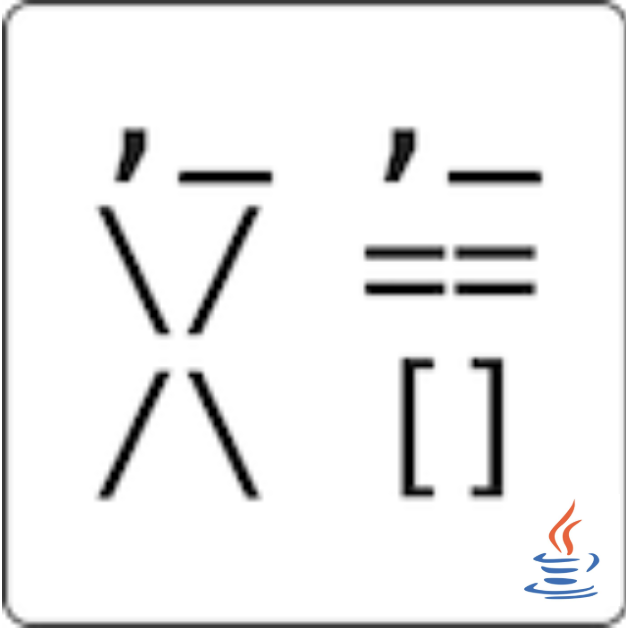

# wenyan-lang_jvm
You can run WenYan Programming Language in JVM.


> 关于作者

作者由于为一高中生，所以不能很快实现全部，并且不能非常严谨的实现，不能确保全部
来自javascript版的wenyan脚本通过编译

> 关于项目

语法源: https://github.com/LingDong-/wenyan-lang 

本项目的目标语言是groovy,以实现动态语言，主要是为了实现
文言lang可以调用java库或groovy库，以实现在虚拟机运行。

java版的编译器是按行编译，所以不支持没有标点分割和不分行，若有有意者，可以实现它

> 与javascript版本的区别

1. 语法相对严格一些，由于实现的原理不同所导致。
2. 区别主要体现在标点必须是'。'分割。
3. 编译为groovy语言
> 目前状态

目前还在开发过程

> 目前实现的语法


| wenyan | groovy |
|---|---|
|`吾有一數。曰三。名之曰「甲」。` | `def jia=3` |
|`吾有一言。曰「「噫吁戲」」。名之曰「乙」。`|`def yi = '噫吁戲'`|
|`吾有一爻。曰陰。名之曰「丙」。` | `def bing = false` |
|`吾有一列。名之曰「丙」。`|`def bing = []`|
|`吾有三數。曰一。曰三。曰五。名之曰「甲」曰「乙」曰「丙」。` | `def jia = 1,yi=3,bing=5` |
|`吾有一數。曰五。書之`| `def ans_1=5 println(ans_1)`|
|`吾有一言。曰「乙」。書之`|`println(yi)`|
|`有數五十。名之曰「大衍」。`|`def dayan = 50`|


> 特殊语法

特殊语法是本编译器独有的语法糖,有些是由于编译器实现的机制所导致的产物

| wenyan | groovy |
|---|---|
|`有言「「好。好。」」。書之。`|`def ans_1 = '好。好。' println(ans_1)`|
|`有列空。名之曰「空也」`|`def kongYe = []`|

> 如何使用

目前编译器还不支持运行，但是可以通过函数库的形式调用

```
    WenYanCompiler compiler = new WenYanCompiler(false);
    compiler.runDirectly(true,
                    "吾有一言。曰「「好。好。」」。書之。" +
                            "吾有一言。曰「「好。好。」」。書之。" +
                            "吾有一爻。曰陰。名之曰「丙」。" +
                            "吾有一爻。曰「丙」。書之。" +
                            "有言「「好。好。」」。書之。" +
                            "有列空。書之。");

```