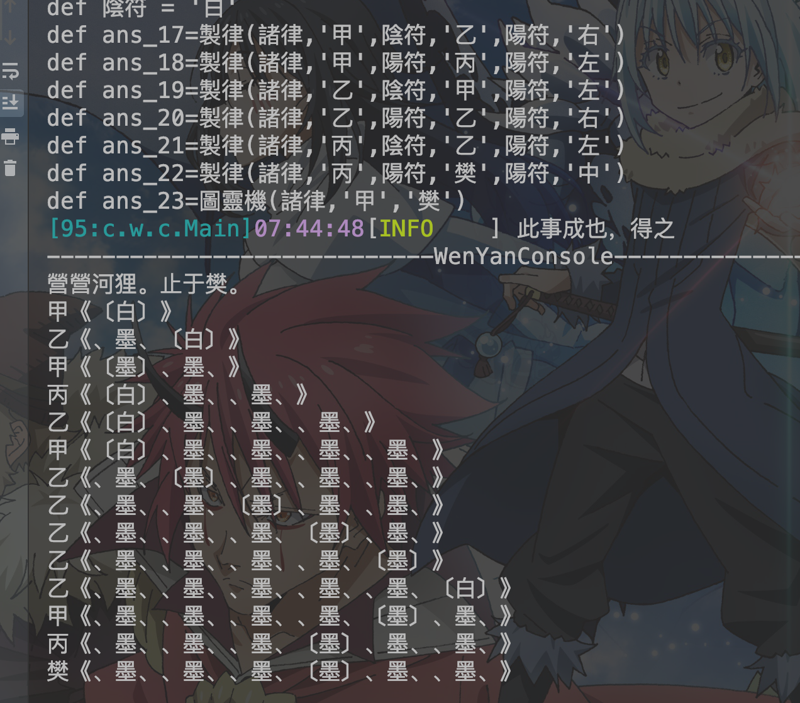

# wenyan-lang_jvm


You can run WenYan Programming Language in JVM.

> 声明

1. 关注本项目不要忘记关注一下语法源:[LingDong的项目](https://github.com/LingDong-/wenyan-lang),因为本项目基于LingDong项目标准开发
2. 语法非作者(MagicLu)原创。
3. 本项目预计未来成形后，将会考虑贡献给WenYan本库。
4. 本项目与LingDong项目一样，遵循MIT许可证
5. 本项目非商业用途，任何人均可贡献，任何人也可以在合适范围内修改README
6. 本项目使用方法可以参见[文档](document/Java-Compiler.md)
7. 关于项目开启的原因可以参见 [#411](https://github.com/LingDong-/wenyan-lang/issues/411)
8. 本项目的目标语言是groovy,以实现动态语言，主要是为了实现`wenyan`可以调用java相关类库(并尽量确保js版本的wy文件)，以实现在虚拟机运行。
9. 对于文渊阁的支持，只需要在项目的src执行wyg i 名称即可。确保在source_path之内

> 相关链接

1. [wenyan_lang](https://github.com/LingDong-/wenyan-lang)
2. [文渊阁](https://github.com/wenyan-lang/wyg)
3. [更新日志](CHANGE_LOG.md)
4. [LICENSE](LICENSE)
5. [语法库](src/main/java/cn/wenyan/compiler/WenYanLib.scala)
6. [文心雕龙](https://wenyan-docs.netlify.com/)

> 关于作者

是时，吾哀感生之须臾，若成大事，于漫岁月之中，如九渊之瀑，同万山之江，见日月星河之走兽，叹古今中外之大事。
夸夸而谈，此为吾之感是也，多愁善感，此为吾之心是矣。
时而求不以物喜不以己悲者，授之于人，而余愧。虽异古人之酌，摘湖中之月。此世千变万化，亦不知后事。
异隐者采菊，观贤者之莲。忆诸葛之往事，憾先主之心胸而无以馈，奸雄无阻而得大业。
叹于时，此非吾之生邪?

1. 作者由于为一高中生，技术水平有限，所以不能很快实现全部语法，并且不能非常严谨的实现，不能确保全部
来自javascript版的wenyan脚本通过编译。

2. 作者目前在 「胶南市第一高级中学」 就读。

3. 作者欢迎所有人发送pull request/issue，拒绝issue灌水和讨论语言使用性，如果有类似的issue，将
无条件关闭，不予回答

4. 由于作者尚未系统学习编译原理，没有使用抽象语法树，通过「正则」和「流程」(Stream) 完成了语言编译。

5. 作者是也是一名文言文爱好者(或者是文学爱好者)

> 项目的特别功能

* 项目的自定义系统
    1. 您可以通过项目的自定义系统自由的将文言文代码翻译为其他语言，通过添加[Language.groovy](src/main/java/cn/wenyan/compiler/script/libs/Language.groovy)的配置
    
    2. 插件系统(实验)
        * 继承[Plugin.scala](src/main/java/cn/wenyan/compiler/plugins/Plugin.scala)，标记Main类，打包为jar包，添加组件即可
* wenyan_shell
    * ` java -jar wenyan.jar shell` 可以开启交互式命令页面
* 文渊阁 for java
    * 尚在策划
    * 基于文渊阁和maven的项目管理插件，可以实现文言文语言和java源代码混合编译
* wenyan_java项目管理
    * 文言项目管理,可以参见[TestMain.java](src/main/java/cn/wenyan/compiler/test/TestMain.java)和[project_example](project_example)文件夹
    * 构建方案
         1. 随便建两个文件夹，为src和target(这名字可以自定义，这是我建议的名字)
         2. src下建一个MakeFile.txt,里面写上主类的路径 
         3. java -jar wenyan.jar -c @src/MakeFile.txt target -sc src -m 主运行类名(类名 = 文件名) 编译，会在target输出全部编译文件
         4. java -jar wenyan.jar -o target -n 主类名 -r 运行

> 与javascript/python/ruby版本的区别

1. 这里支持了编译为groovy
2. 对于文件名称要求严格，不能使用特殊符号标记

> 实现效果

已经可以运行wenyan-lang的[图灵机](https://github.com/LingDong-/wenyan-lang/blob/master/examples/turing.wy)，图灵完备



> 目前实现的语法

##### 變量
| wenyan | groovy |
|---|---|
|`吾有一數。曰三。名之曰「甲」。` | `def jia=3` |
|`吾有一言。曰「「噫吁戲」」。名之曰「乙」。`|`def yi = '噫吁戲'`|
|`吾有一爻。曰陰。名之曰「丙」。` | `def bing = false` |
|`吾有一列。名之曰「丙」。`|`def bing = []`|
|`吾有三數。曰一。曰三。曰五。名之曰「甲」曰「乙」曰「丙」。` | `def jia = 1,yi=3,bing=5` |
|`吾有一數。曰五。書之`| `def ans_1=5 println(ans_1)`|
|`吾有一言。曰「乙」。書之`|`println(yi)`|
|`有數五十。名之曰「大衍」。`|`def dayan = 50`|
|`昔之「甲」者。今「大衍」是也。`|`jia = dayan`|
|`吾有一元`|`(auto type)`|

##### 数组
| wenyan | groovy|
|---|---|
|`吾有一列。名之曰「甲」。充「甲」以四。以二。`|	`def a = []; a.add(1);`|
|`夫「甲」之一。`	| `a[0]`|
|`夫「玫瑰」之「「名」」`|	`rose["name"]`|
|`夫「甲」之其餘。`|`a.slice(1)`|
|`夫「寶劍」之長。`|	`sword.size();`|
|`銜「甲」以「乙」。以「丙」`|`jia.putAll(yi) jia.putAll(bing)`|
##### 註釋
| wenyan | groovy |
|---|---|
|`批曰。「「文氣淋灕。字句切實」」。`|`/*文氣淋灕。字句切實*/`|
|`注曰。「「文言備矣」」。`	|`/*文言備矣*/`|
|`疏曰。「「居第一之位故稱初。以其陽爻故稱九」」。`|`/*居第一之位故稱初。以其陽爻故稱九*/`|

##### 控制
| wenyan | groovy |
|---|---|
|`為是百遍。⋯⋯ 云云。`|`for (i in 1..100){ ... }`|
|`若「甲」等於「乙」者。......也。`|`if(jia == yi){`|
|`若非。`|`}else{`|
|`恆為是。⋯⋯ 云云。`|`while (true) { ... }`|
|`乃止。`|`break`|
|`凡「天地」中之「人」。⋯⋯ 云云。`|`for (human in world){ ... }`|
|`或若`|`else if`|
|`若其然者`|	`if (ans) {`|
|`若其不然者`|	`if (!ans) {`|
##### 數學

| wenyan | groovy |
|---|---|
|`加一以二。`	|`1+2`|
|`加一於二。`|`2+1`|
|`加一以二。乘其以三。`|`(1+2)*3`|
|`除十以三。所餘幾何。`|`10%3`|
|`減七百五十六以四百三十三。名之曰「甲」。`|`def a = 756-433;`|
|`夫「甲」「乙」中有陽乎`|`a \|\| b`|
|`夫「甲」「乙」中無陰乎。`|`a&&b`|

##### 导入
| wenyan | groovy |
|---|---|
|`吾嘗觀「「算經」」之書。方悟「正弦」之義。`|`import static 算经.正弦`|
|`吾嘗觀「「某樓」」中「「某閣」」中「「某書」」之書`| `import 某樓.某閣.某書`|

##### 函数
| wenyan | groovy |
|---|---|
|`吾有一術。名之曰「吸星大法」。是術曰。⋯⋯是謂「吸星大法」之術也。`|`def a(){...}`|
|`吾有一術。名之曰「六脈神劍」。欲行是術。必先得六數。曰「甲」。曰「乙」。曰「丙」。曰「丁」。曰「戊」。曰「己」乃行是術曰。⋯⋯是謂「六脈神劍」之術也。`|`def b(a,b,c,d,e,f){...}`|
|`施「翻倍」於「大衍」`|`b(dayuan)`|
|`施「翻倍」`|`b()`|
|`夫「甲」。夫「乙」。夫「丙」。取二以施「丁」。取二以施「戊」。取一以施「己」。夫「庚」。夫「辛」。取三以施「壬」。名之曰「癸」。`|`def j = i(f(e(a,d(b,c))),g,h)`|

##### 宏
| wenyan | groovy |
|---|---|
|`或云「「書「甲」焉」」。蓋謂「「吾有一言。曰「甲」。書之」」。`|`Compiled Code`|
##### 异常处理
| wenyan| groovy|
|---|---|
|`姑妄行此`|try|
|`其他异常有关语句均实现`|

##### 对象
| wenyan | groovy |
|---|---|
|`吾有一物。名之曰「甲」。`|`def a = [:]`
|` 吾有一物。名之曰「甲」。其物如是。物之「「乙」」者。數曰三。物之「「丙」」者。言曰「「丁」」。是謂「甲」之物也`|`def a = [b:3,c:"d"]`|


> 特殊语法

特殊语法是本编译器独有的语法糖,有些是由于编译器实现的机制所导致的产物

本編譯器允許直接使用`書之`，可以輸出最後定義的變量

| wenyan | groovy |
|---|---|
|`有言「「好。好。」」。書之。`|`def ans_1 = '好。好。' println(ans_1)`|
|`有列空。名之曰「空也」`|`def kongYe = []`|

调用静态方法

```
吾嘗觀「「java」」中「「lang」」中「「Math」」之書。
施「Math.pow」於「大衍」於二。名之曰「矣」。書之
```

使用java对象
```
施「new String」於「大衍」。名之曰「矣」。
施「矣.getClass」。書之。
```

> 如何使用

`-p` 值:true/false 是否支持拼音

`-c` 值: @MakeFile-> 批量编译文件，将文件路径一行一行的写入即可 / 一个文件名，只编译一个文件

`-o` 值: 输出文件夹的路径

`-l`  值: 编译所用lib,多个lib路径用`;`分割

`-r` 值: 运行时的参数 注意: 这个选项必须放在最后面,会将文件运行

`-sc` 值: src文件夹的路径

`-m` 值: 主类路径

> 直接加载文言文脚本

```groovy
import cn.wenyan.compiler.WenYanTools

def compiler = WenYanTools.makeCompiler()

def javaClass = compiler.compileToClass("HelloWorld","吾有一言，曰『问天地好在』，書之。")

javaClass.getDeclaredMethod("run").invoke(javaClass.newInstance())

```

> 目前需要迫切实现的

- shell 高级操作
    - 导入jar包/wy文件
- idea 插件
- maven插件

> 编译器原始的第三方包导入

1. 编译器将wy文件编译为class字节码文件
2. 将class字节码文件打包为jar包
3. 通过编译器-l导入进去即可
